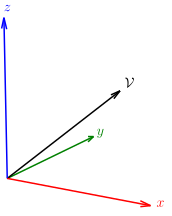

# Generating figures

We want to have figures with latex annotations. One way to do this is:

+ Generate a figure using `matplotlib` and save it using

	```python
	fig.savefig("example.pgf", backend="pgf", transparent=True)
	```

+ Generate a standalone `pdf` from the `pgf` using

 	```bash
	tectonic standalone.tex
	```
	with
	```latex title="standalone.tex"
	\documentclass{standalone}
	\usepackage{tikz}
	\begin{document}
	\input{example.pgf}
	\end{document}
	```

+ Convert the `pdf` to `svg`

    ```bash
	pdf2svg example.pdf example.svg
	```
	On `fedora` we need to `dnf install pdf2svg`.

+ And add the figure as follows

<figure markdown="span">
  { width="300" }
</figure>

See the `generate-example-figure` target in `misc/figures/Makefile`.
